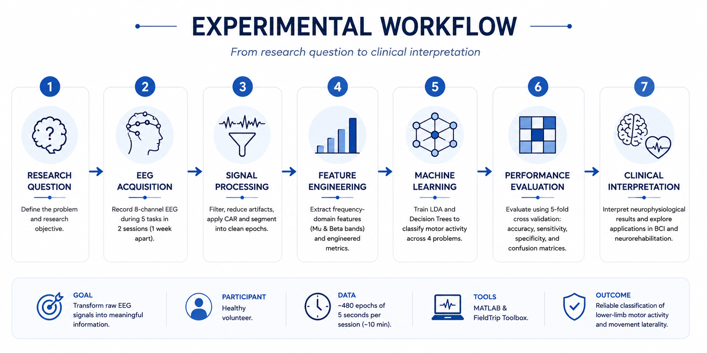
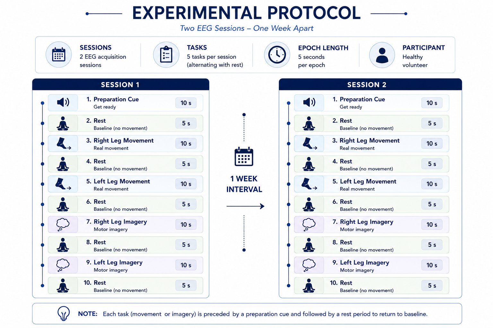
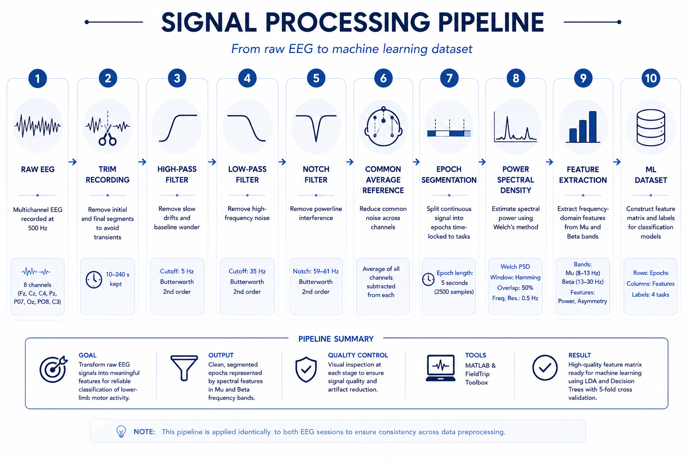
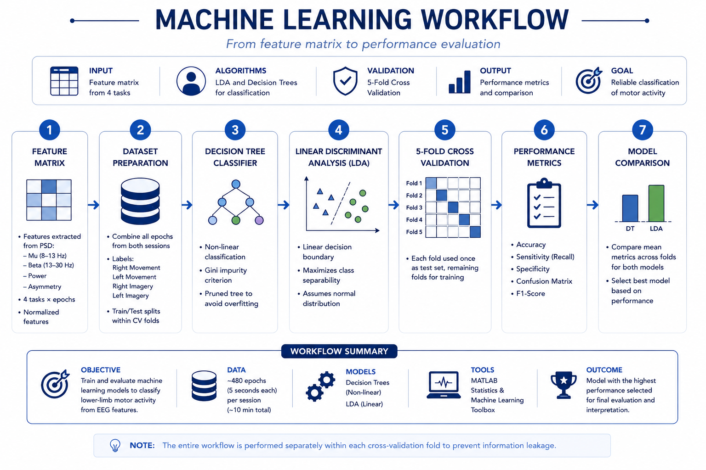
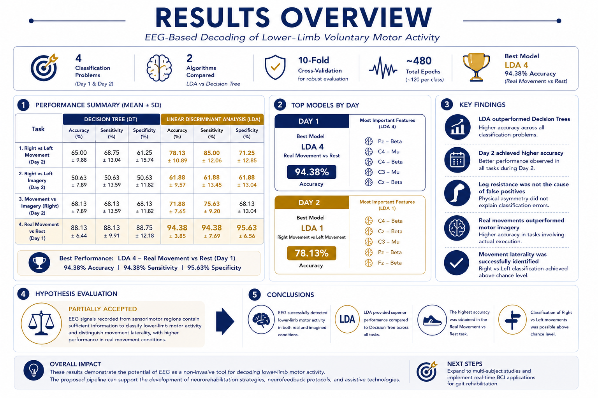

<p align="center">
  
</p>

<br>

# EEG-Based Motor Intent Classification for Lower-Limb Movements

---

## Quick Facts

| Attribute | Details |
|-----------|----------|
| **Project Type** | Academic Research Project |
| **Field** | Biomedical Engineering |
| **Domain** | Brain–Computer Interfaces (BCIs) |
| **Institution** | Tecnológico de Monterrey |
| **Course** | Design and Development in Neuroengineering |
| **Programming Language** | MATLAB |
| **Libraries** | FieldTrip Toolbox |
| **Data Type** | Electroencephalography (EEG) |
| **Dataset** | Experimental EEG recordings from a healthy volunteer *(not publicly available for privacy reasons)* |
| **Machine Learning Models** | Linear Discriminant Analysis (LDA), Decision Trees |
| **Validation Strategy** | 5-Fold Cross Validation |
| **Repository Status** | Under Active Documentation |

---

# Executive Summary

This repository presents an end-to-end biomedical data analytics workflow for decoding lower-limb motor activity from electroencephalographic (EEG) signals.

The project integrates experimental data acquisition, signal preprocessing, feature engineering, machine learning, and neurophysiological interpretation to evaluate whether EEG signals can reliably classify lower-limb motor activity.

Rather than focusing exclusively on model performance, this repository documents the complete analytical pipeline required to transform raw biomedical signals into meaningful information.

---

# Why This Project Matters

Brain–Computer Interfaces (BCIs) are emerging technologies capable of translating neural activity into commands for external systems. Their applications include neurorehabilitation, assistive technologies, prosthetic control, and communication systems for patients with neurological disorders.

Reliable decoding of lower-limb motor intentions remains challenging because EEG signals exhibit low signal-to-noise ratios, inter-subject variability, and non-stationary behavior.

This project explores how signal processing and machine learning techniques can be combined to classify voluntary lower-limb motor activity using EEG recordings.

---

# Research Question

> Can EEG signals recorded over sensorimotor regions reliably classify lower-limb motor activity and distinguish movement laterality using machine learning techniques?

---

# Objectives

This project aims to:

- Develop an EEG processing pipeline for lower-limb motor activity.
- Improve EEG signal quality through preprocessing.
- Extract meaningful neurophysiological features.
- Train and evaluate machine learning classifiers.
- Compare classification performance across multiple motor tasks.

---

<p align="center">
  
</p>

<p align="center">
<i>Figure 1. End-to-end analytical workflow from EEG acquisition to clinical interpretation.</i>
</p>

---

# Experimental Design

The study consisted of **two EEG acquisition sessions**, separated by **one week**, to evaluate the reproducibility of lower-limb motor activity recordings over time.

During each session, the participant completed a structured experimental protocol including alternating periods of:

- Rest
- Right-leg movement
- Right-leg motor imagery
- Left-leg movement
- Left-leg motor imagery

Each task followed a predefined timing sequence, enabling automatic segmentation and labeling of EEG epochs during the data processing stage.

All EEG recordings were acquired using an eight-channel BioSemi system and later processed in MATLAB using the FieldTrip toolbox.

---

## Experimental Protocol

<p align="center">
  
</p>

<p align="center">
<i><b>Figure 2.</b> Experimental protocol consisting of two EEG acquisition sessions separated by one week. During each session, the participant completed alternating periods of rest, lower-limb movement, and motor imagery following a standardized timing sequence.</i>
</p>

---

# Data Acquisition

EEG recordings were acquired using the following channels:

- Fz
- C3
- Cz
- C4
- Pz
- PO7
- Oz
- PO8

Raw signals were stored in BioSemi BDF format and processed using the FieldTrip MATLAB toolbox.

---

# Signal Processing Pipeline

The complete preprocessing workflow transformed raw EEG recordings into a structured feature matrix suitable for machine learning. Each stage was implemented in MATLAB using the FieldTrip toolbox to ensure reproducibility and consistent processing across both acquisition sessions.

<p align="center">
  
</p>

<p align="center">
<i><b>Figure 3.</b> End-to-end preprocessing pipeline applied to the raw EEG recordings, including filtering, common average referencing, epoch segmentation, spectral analysis, and feature extraction prior to machine learning.</i>
</p>

---

# Preprocessing

The preprocessing pipeline included:

- Removal of the initial recording segment.
- High-pass FIR filter (5 Hz).
- Low-pass FIR filter (35 Hz).
- Notch FIR filter (59–61 Hz).
- Common Average Reference (CAR).
- Segmentation into 480 epochs of 5 seconds each.

---

# Feature Engineering

Features were extracted from frequency-domain representations of EEG signals.

Frequency bands included:

- Mu (8–13 Hz)
- Low Beta (13–20 Hz)
- High Beta (20–30 Hz)
- Motor Band (8–30 Hz)

Additional engineered features included:

- C3–C4 asymmetry
- Cz versus lateral motor cortex activity

These features were used as predictors for machine learning models.

---

# Machine Learning Workflow

The extracted EEG features were organized into a structured dataset and used to train multiple supervised classification models. Decision Trees and Linear Discriminant Analysis (LDA) were evaluated using a 5-fold cross-validation strategy to compare their ability to classify lower-limb motor activity.

<p align="center">
  
</p>

<p align="center">
<i><b>Figure 4.</b> Machine learning workflow from feature matrix construction to model comparison and performance evaluation using cross-validation.</i>
</p>


---

# Performance Evaluation

Model performance was evaluated using:

- Accuracy
- Sensitivity
- Specificity
- Confusion Matrices

---

# Results

> This section will include:

- Classification accuracies
- Confusion matrices
- Decision trees
- Performance comparison tables

---

## Results Overview

The evaluated machine learning models demonstrated the feasibility of decoding lower-limb motor activity from EEG signals. Model performance was assessed across multiple binary classification tasks using a consistent cross-validation strategy.

<p align="center">
  
</p>

<p align="center">
<i><b>Figure 5.</b> Summary of the machine learning performance across the evaluated classification tasks, including model comparison, representative confusion matrices, and key findings.</i>
</p>

---

# Lessons Learned

This project strengthened both my technical and analytical skills by exposing me to the complete lifecycle of a biomedical data analysis project.

Some of the most valuable lessons I learned include:

- Designing and implementing a reproducible EEG acquisition protocol.
- Understanding how preprocessing decisions directly influence signal quality and model performance.
- Applying feature engineering techniques based on neurophysiological knowledge rather than relying solely on machine learning algorithms.
- Evaluating classification models using cross-validation and interpreting their performance beyond overall accuracy.
- Appreciating the importance of clear technical documentation and reproducible analytical workflows when working on collaborative research projects.

One of the most important takeaways from this project was realizing that successful biomedical data analysis depends not only on selecting an appropriate machine learning model, but also on careful experimental design, high-quality data preprocessing, and thoughtful interpretation of the results.

---

# Skills Demonstrated

# Skills Demonstrated

| Technical Skills | Data Analytics Skills |
|------------------|-----------------------|
| MATLAB | Data Cleaning |
| FieldTrip Toolbox | Signal Processing |
| EEG Analysis | Feature Engineering |
| Machine Learning | Model Evaluation |
| Decision Trees | Cross Validation |
| Linear Discriminant Analysis | Data Visualization |
| Git & GitHub | Technical Documentation |
| Scientific Research | Analytical Thinking |

---

# Future Work

Potential improvements include:

- Evaluation using larger datasets.
- Deep learning approaches.
- Subject-independent classification.
- Real-time BCI implementation.
- Additional feature selection techniques.

---

## Repository Structure

```text
src/
│
├── main.m
│
├── preprocessing/
│
├── analysis/
│
├── models/
│
└── utils/
```

---

# My Contributions

As part of a multidisciplinary team, my primary responsibilities included:

- Supporting the EEG acquisition setup and channel verification.
- Reviewing the consistency of task labels and rest periods.
- Contributing to the ERD/ERS topographic analysis.
- Reviewing the literature related to Mu and Beta rhythms.
- Participating in the interpretation of the results and the development of the project conclusions.

In addition, I independently redesigned and documented this repository as part of my professional Biomedical Data Analytics portfolio.

---

# Why This Repository Is Part of My Portfolio

This project represents one of my first complete biomedical data analytics workflows.

It demonstrates how raw physiological signals can be transformed into meaningful information through reproducible preprocessing, feature engineering, statistical analysis, and machine learning.

Beyond the classification models themselves, this repository reflects my approach to documenting analytical workflows in a clear, organized, and reproducible manner.

---

# Acknowledgments

This project was developed as part of the Design and Development in Neuroengineering course at Tecnológico de Monterrey.

---

# References

The methodology, preprocessing pipeline, and interpretation of the results were supported by the following scientific publications:

1. Pfurtscheller, G., & Neuper, C. (2001). *Motor imagery and direct brain-computer communication*. Proceedings of the IEEE, 89(7), 1123–1134. https://doi.org/10.1109/5.939829

2. Langhorne, P., Coupar, F., & Pollock, A. (2009). *Motor recovery after stroke: A systematic review*. The Lancet Neurology, 8(8), 741–754. https://doi.org/10.1016/S1474-4422(09)70150-4

3. Ward, N. S. (2017). *Restoring brain function after stroke—Bridging the gap between animals and humans*. Nature Reviews Neurology, 13(4), 244–255. https://doi.org/10.1038/nrneurol.2017.34

4. Hsu, W.-C., Lin, L.-F., Chou, C.-W., Hsiao, Y.-T., & Liu, Y.-H. (2017). *EEG classification of imaginary lower limb stepping movements based on fuzzy support vector machine with kernel-induced membership function*. International Journal of Fuzzy Systems, 19(2), 566–579. https://doi.org/10.1007/s40815-016-0259-9

5. Tariq, M., Trivailo, P. M., & Simic, M. (2020). *Mu-Beta event-related (de)synchronization and EEG classification of left-right foot dorsiflexion kinaesthetic motor imagery for BCI*. PLOS ONE, 15(3), e0230184. https://doi.org/10.1371/journal.pone.0230184

6. Gu, L., Yu, Z., Ma, T., Wang, H., Li, Z., & Fan, H. (2020). *EEG-based classification of lower limb motor imagery with brain network analysis*. Neuroscience, 436, 93–109. https://doi.org/10.1016/j.neuroscience.2020.04.006